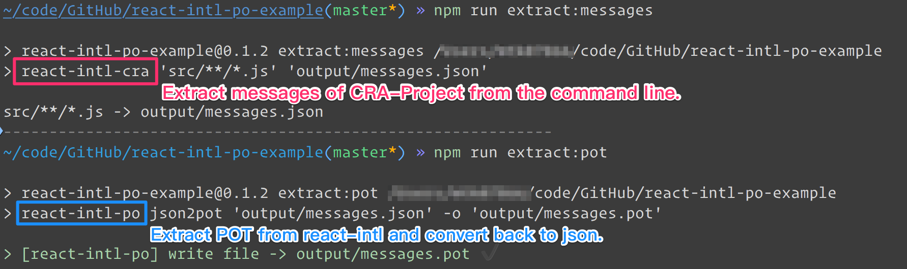

## React-intl-po-example [](https://travis-ci.org/evenchange4/react-intl-po-example) [](https://greenkeeper.io/)

> This is a standalone project for using react-intl-po with CRA. Futher Reading: [中文](https://medium.com/@evenchange4/i18n-workflow-for-react-project-9f9ff8fe9aef)

## Screenshots



## Logs

### 1. Create a project with zero config

```
$ npm i create-react-app -g
$ create-react-app react-intl-po-example
$ cd react-intl-po-example
$ yarn start
```

### 2. Introduce react-intl packages

```
$ yarn add react-intl react-intl-po react-intl-cra
```

```diff
  "extract:messages": "react-intl-cra 'src/**/*.js' 'output/messages.json'",
+ "extract:pot": "react-intl-po json2pot 'output/messages.json' -o 'output/messages.pot'"
```
